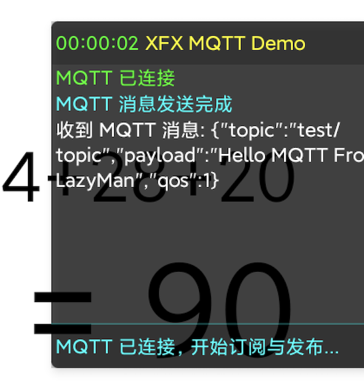
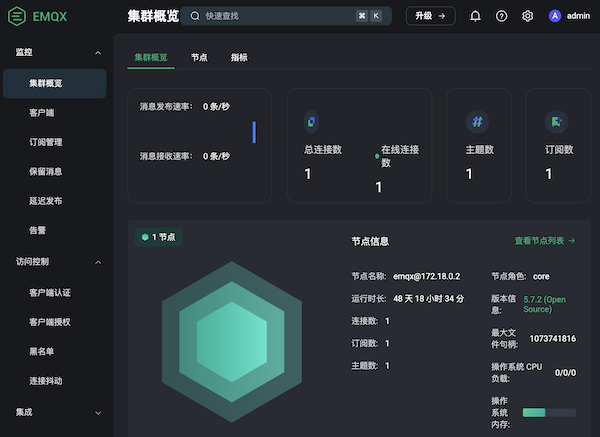
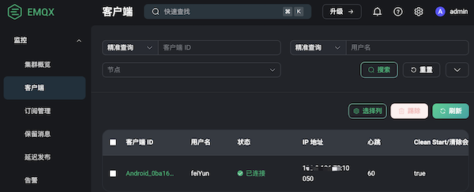

## 模块简介

`MqttOps` 是 MQTT 客户端的单例封装（调用[Eclipse Paho 库](https://github.com/eclipse-paho/paho.mqtt.java)，支持 MQTT 3.1/3.1.1/5.0 协议），支持创建客户端（TCP/WebSocket/WSS）、设置连接/消息回调、连接/断开/重连、发布/订阅、缓冲与重连配置、获取最近消息与错误信息。

## 功能概览

- **客户端创建**：配置协议（含 wss）、地址、端口、心跳、重连、遗嘱等
- **回调设置**：连接成功、连接丢失、消息到达、投递完成、重连前/失败、认证失败、缓冲溢出
- **连接控制**：连接、断开、立即重连、关闭与释放
- **发布/订阅**：发布文本/二进制、订阅、取消
- **状态与信息**：连接状态、Broker URL、clientId、重连次数、缓冲消息数、最近消息 JSON、最近错误
- **高级配置**：自动重连开关、clean session、断线缓冲参数

## API 接口列表

### 1. 客户端创建

#### createClient()

创建并配置 MQTT 客户端（全局单例）。

> 使用WSS协议时，如果服务端证书是公信 CA，Android 系统默认信任；暂不支持自签名/私有 CA。

| 参数名 | 类型 | 必填 | 说明 |
|--------|------|------|------|
| protocol | String | 是 | 协议头，例如 "tcp://" 或 "ws://"、"wss://" |
| host | String | 是 | 服务器地址 |
| port | Int | 是 | 端口 |
| path | String? | 否 | WebSocket 路径，例如 "/mqtt"；普通 TCP 留空 |
| clientId | String? | 否 | 客户端 ID，传空时自动生成（如果需要持久化，请确保 clientId 唯一） |
| username | String? | 否 | 用户名（可选） |
| password | String? | 否 | 密码（可选） |
| keepAliveInterval | Int | 是 | 心跳秒数 |
| maxReconnectAttempts | Int | 是 | 最大自动重连次数，-1 表示无限重连 |
| baseReconnectDelayMs | Long | 是 | 基础重连间隔 ms |
| maxReconnectDelayMs | Long | 是 | 最大重连间隔 ms |
| isAsyncConnect | Boolean | 是 | 是否异步连接 |
| isCleanSession | Boolean | 是 | 是否清理会话 |
| willTopic | String? | 否 | 遗嘱消息的主题（可选） |
| willPayload | String? | 否 | 遗嘱消息内容（可选） |
| willQos | Int | 是 | 遗嘱 QoS |
| willRetained | Boolean | 是 | 遗嘱消息是否保留 |


**示例：**
```lua
local mqttOps = UtilsMain.mqttOps()
mqttOps.createClient("tcp://", "broker.hivemq.com", 1883, "", "luaClient", nil, nil, 30, -1, 1000, 30000, true, true, "will/topic", "bye", 0, false)
```

### 2. 回调设置

以下回调均接收 `Runnable?`，在事件触发时执行。

#### onConnected()

设置连接成功回调。

| 参数名 | 类型 | 必填 | 说明 |
|--------|------|------|------|
| callback | Runnable? | 否 | 连接成功回调 |

#### onConnectLost()

设置连接丢失回调。

| 参数名 | 类型 | 必填 | 说明 |
|--------|------|------|------|
| callback | Runnable? | 否 | 连接丢失回调 |

#### onMessage()

设置消息到达回调。

| 参数名 | 类型 | 必填 | 说明 |
|--------|------|------|------|
| callback | Runnable? | 否 | 消息到达回调 |

#### onSendComplete()

设置消息投递完成回调。

| 参数名 | 类型 | 必填 | 说明 |
|--------|------|------|------|
| callback | Runnable? | 否 | 投递完成回调 |

#### onReconnect()

设置重连前回调（每次尝试重连前触发）。

| 参数名 | 类型 | 必填 | 说明 |
|--------|------|------|------|
| callback | Runnable? | 否 | 重连前回调 |

#### onReconnectFailed()

设置重连失败回调（达到最大重连次数后触发）。

| 参数名 | 类型 | 必填 | 说明 |
|--------|------|------|------|
| callback | Runnable? | 否 | 重连失败回调 |

#### onAuthFailed()

设置认证失败回调（连接失败且返回认证错误时触发）。

| 参数名 | 类型 | 必填 | 说明 |
|--------|------|------|------|
| callback | Runnable? | 否 | 认证失败回调 |

#### onBufferOverflow()

设置缓冲区溢出回调（断线缓冲已满时触发）。

| 参数名 | 类型 | 必填 | 说明 |
|--------|------|------|------|
| callback | Runnable? | 否 | 缓冲溢出回调 |

### 3. 连接控制

#### connect()

发起连接。

#### reconnectNow()

立即触发一次主动重连（先断开再连接）。


#### disConnect()

主动断开，不会触发自动重连逻辑（自动重连只在连接意外断开或连接失败时触发）。

#### close()

关闭并释放客户端实例。

#### isConnected()

查询当前连接状态。

| 返回值类型 | 说明 |
|-----------|------|
| Boolean | 已连接返回 true |

**示例：**
```lua
local mqttOps = UtilsMain.mqttOps()
mqttOps.connect()
print("connected?", mqttOps.isConnected())
mqttOps.disConnect()
```

### 4. 发布与订阅

#### publish() 

发布文本消息。

| 参数名 | 类型 | 必填 | 说明 |
|--------|------|------|------|
| topic | String | 是 | 主题 |
| payload | String | 是 | 文本内容 |
| qos | Int | 是 | QoS 0/1/2 |
| retained | Boolean | 是 | 是否保留 |

#### publish() 

发布二进制消息。

| 参数名 | 类型 | 必填 | 说明 |
|--------|------|------|------|
| topic | String | 是 | 主题 |
| payload | ByteArray | 是 | 二进制内容 |
| qos | Int | 是 | QoS 0/1/2 |
| retained | Boolean | 是 | 是否保留 |

#### subscribe()

订阅主题。

| 参数名 | 类型 | 必填 | 说明 |
|--------|------|------|------|
| topic | String | 是 | 主题 |
| qos | Int | 是 | QoS 0/1/2 |

<!-- #### subscribeBatch()

批量订阅。

| 参数名 | 类型 | 必填 | 说明 |
|--------|------|------|------|
| topics | Array<String> | 是 | 主题列表 |
| qosArr | IntArray? | 否 | 与主题一一对应的 QoS，长度不足用 0 补 | -->

#### unSubscribe()

取消订阅。

| 参数名 | 类型 | 必填 | 说明 |
|--------|------|------|------|
| topic | String | 是 | 主题 |

<!-- #### unSubscribe

批量取消订阅。

| 参数名 | 类型 | 必填 | 说明 |
|--------|------|------|------|
| topics | Array<String> | 是 | 主题列表 |

**示例：**
```lua
local mqttOps = UtilsMain.mqttOps()
-- 单个订阅/发布/取消
mqttOps.subscribe("demo/topic", 0)
mqttOps.publish("demo/topic", "hi", 0, false)
mqttOps.unSubscribe("demo/topic")

-- 批量订阅（qosArr 不足时自动补 0）
mqttOps.subscribeBatch(jsonLib.encode({"a/1", "a/2", "a/3"}), jsonLib.encode({1, 0, 2}))

-- 批量取消订阅
mqttOps.unSubscribe(jsonLib.encode({"a/1", "a/2", "a/3"}))
``` -->

### 5. 状态与信息

#### getLastMsg()

获取最近一条消息（JSON 字符串）。

| 返回值类型 | 说明 |
|-----------|------|
| String | 最近消息 JSON |

#### getLastError()

获取最近一次错误信息。

| 返回值类型 | 说明 |
|-----------|------|
| String? | 错误信息或 null |

#### getBrokerUrl()

获取当前 Broker URL。

| 返回值类型 | 说明 |
|-----------|------|
| String | 形如 protocol://host:port/path |

#### getClientId()

获取当前 clientId（可能为自动生成值）。

| 返回值类型 | 说明 |
|-----------|------|
| String | clientId |

#### getReconnectCount()

获取当前重连计数。

| 返回值类型 | 说明 |
|-----------|------|
| Int | 已尝试重连次数 |

#### getBufferedMessageCount()

获取断线缓冲中的消息数量。

| 返回值类型 | 说明 |
|-----------|------|
| Int | 缓冲中的待发消息数 |

### 6. 高级配置

#### setAutoReconnect()

设置自动重连开关。

| 参数名 | 类型 | 必填 | 说明 |
|--------|------|------|------|
| enabled | Boolean | 是 | 是否自动重连 |

#### setCleanSession()

设置 clean session。

| 参数名 | 类型 | 必填 | 说明 |
|--------|------|------|------|
| enabled | Boolean | 是 | 是否清理会话 |

#### setBufferOptions()

配置断线缓冲。

| 参数名 | 类型 | 必填 | 说明 |
|--------|------|------|------|
| enabled | Boolean | 是 | 是否启用缓冲 |
| size | Int | 是 | 缓冲大小 |
| persist | Boolean | 是 | 是否持久化缓冲 |
| deleteOldest | Boolean | 是 | 满时是否删最旧消息 |


**示例：**
```lua
local mqttOps = UtilsMain.mqttOps()
print("last msg:", mqttOps.getLastMsg())
print("last err:", mqttOps.getLastError())
```

## 完整示例

```lua
-- 导入java的类模块
import('com.nx.assist.lua.LuaEngine')
import('java.lang.Runnable')

-- 加载插件（从资源文件或者从本地路径加载）
local loader = LuaEngine.loadApk('xfxPlugin-release.apk'); assert(loader)
-- 获取应用的上下文
local context = LuaEngine.getContext()   
-- 加载插件的入口类
local UtilsMain = loader.loadClass('com.xfx.plugin.UtilsMain'); assert(UtilsMain)
-- UtilsMain.init(context)

-- 加载插件后，获取 mqttOps 实例
local mqttOps = UtilsMain.mqttOps()

-- 创建客户端(确保端口已开放)
mqttOps.createClient("ws://", "服务器IP", 8083, "/mqtt", "luaClient", 'feiYun', 'testPass', 60, -1, 1000, 30000, true, true, "will/topic", "client offline", 1, false)

-- 设置回调
mqttOps.onConnected(
    Runnable {
        run = function()
            print("连接成功", mqttOps.getBrokerUrl())
        end
    }
)
mqttOps.onConnectLost(
    Runnable {
        run = function()
            print("连接丢失")
        end
    }
)
mqttOps.onMessage(
    Runnable {
        run = function()
            print("收到消息")
        end
    }
)
mqttOps.onSendComplete(
    Runnable {
        run = function()
            print("发送完成")
        end
    }
)


-- 连接服务端
mqttOps.connect()
sleep(1000)  -- 等待连接成功
print("连接结果", mqttOps.isConnected())

-- 订阅 / 发布 / 取消
mqttOps.subscribe("demo/topic", 0)
print('发送消息...')
mqttOps.publish("demo/topic", "hello mqttOps", 0, false)
sleep(1000)  -- 等待消息到达

print("最近消息:", mqttOps.getLastMsg())

print('取消订阅...')
mqttOps.unSubscribe("demo/topic")

-- -- 状态与错误
-- print("最后错误:", mqttOps.getLastError())

print('触发自动重连...')
mqttOps.reconnectNow()
sleep(5*1000)  -- 等待重连成功

-- 这里可以做一些断线重连的测试。例如，重启服务端，触发本地客户端的连接意外断开。等服务端再次运行后，这里就会自动重连。
-- sleep(60*1000)  -- 等待重连成功

print('断开连接...')
mqttOps.disConnect()

print('关闭客户端...')
mqttOps.close()

print('完成')
```


## OOP 例子

```lua
import('com.nx.assist.lua.LuaEngine')

local xfxPluginPath = 'xfxPlugin-release.apk'   -- 读取RC资源文件
local xfxModule = require('lib/XfxPlugin')

local XFX = xfxModule:new({
    apkName = xfxPluginPath,
    context = LuaEngine.getContext(),
})

-- 获取屏幕信息
local screenOps = XFX:getOps('screenOps')
local screenWidth = screenOps.getScreenWidth()
local screenHeight = screenOps.getScreenHeight()
print('屏幕宽度: ' .. tostring(screenWidth))
print('屏幕高度: ' .. tostring(screenHeight))

-- 获取设备信息
local deviceOps = XFX:getOps('deviceOps')
local deviceID = deviceOps.getAndroidID()
print('设备ID: ' .. tostring(deviceID))

-- 打开浮窗日志，方便观察 MQTT 状态
XFX:showFloatLogWindow({
    left = math.floor(screenWidth / 2),
    top = math.floor(screenHeight / 4),
    width = math.floor(screenWidth / 2),
    height = math.floor(screenHeight / 6),
    isShowProgressBar = true,
    isBottomInfo = true,
    isControlBtn = true,
})

XFX:setFloatLogTitle('XFX MQTT Demo')
XFX:setFloatLogInfo('准备连接 MQTT...')

-- 初始化 MQTT 客户端
XFX:initMqttClient({
    -- protocol = 'tcp://',
    -- host = '服务器IP',
    -- port = 7789,
    -- path = '',
    protocol = 'ws://',
    host = '服务器IP',
    port = 8083,
    path = '/mqtt',
    clientId = 'Android_'..deviceID,          -- 为空则自动生成
    username = 'feiYun',  -- 按你自己的 EMQX 配置
    password = 'testPass',

    keepAliveInterval = 60,
    maxReconnectAttempts = -1,
    baseReconnectDelayMs = 1000,
    maxReconnectDelayMs = 30000,
    isAsyncConnect = true,
    isCleanSession = true,
    willTopic = 'client/lastwill',
    willPayload = 'client offline',
    willQos = 1,
    willRetained = false,

    onConnected = function()
        XFX:logs('MQTT 已连接')
        XFX:setFloatLogInfo('MQTT 已连接，开始订阅与发布...')
        -- 连接成功后订阅一个主题并发一条消息
        XFX:mqttSubscribe('test/topic', 1)
        XFX:mqttPublish('test/topic', 'Hello MQTT From LazyMan', 1, false)
    end,

    onConnectLost = function()
        XFX:logw('MQTT 连接断开: ' .. tostring(XFX:getLastMqttError()))
        XFX:setFloatLogInfo('MQTT 连接已断开，等待自动重连...')
    end,

    onMessage = function(msgJson)
        XFX:logi('收到 MQTT 消息: ' .. tostring(msgJson))
    end,

    onSendComplete = function()
        XFX:logd('MQTT 消息发送完成')
    end,
})

-- 发起连接
XFX:mqttConnect()
sleep(3000)  -- 等待连接成功

-- 运行一段时间后关闭（示例）
sleep(30000)
XFX:mqttDisconnect()
XFX:mqttClose()

XFX:closeFloatLog()
```

### 安卓显示效果


### EMQX服务端后台显示效果

[EMQX](https://docs.emqx.com/zh/emqx/v5.7/) 是一款「无限连接，任意集成，随处运行」的大规模分布式物联网接入平台，提供丰富的 MQTT 协议扩展，可以满足物联网领域的各种需求。
推荐使用 `宝塔+Docker` 部署到 Linux 云服务器上。






## 常见问题

### 1. 连接失败

- **网络问题**：确保网络畅通，可以尝试使用手机热点或其它网络环境。
- **端口问题**：确保服务器端口已开放，可以尝试使用其它端口。
- **协议问题**：确保协议正确，可以尝试使用其它协议。
- **路径问题**：确保路径正确，可以尝试使用其它路径。
- **其它问题**：可以尝试使用其它 MQTT 服务端进行连接，确认是否是服务端问题。

## 注意事项

- **单例限制**：内部仅维护单客户端；重新创建会覆盖旧实例。
- **网络与权限**：需网络权限；WebSocket 需正确的协议/路径配置。 

