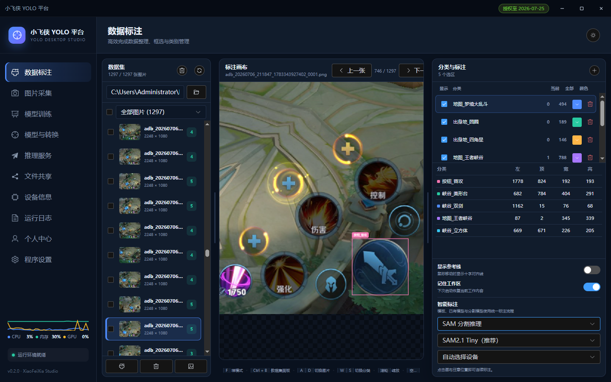

## 模块简介

`YoloOps` 提供 YOLO 目标识别接口，面向安卓移动端图片识别场景。

> 已接入 [NCNN Android Vulkan](https://github.com/Tencent/ncnn/) 推理引擎(ncnn-20260526-vulkan)。

## 模型要求

模型统一使用 NCNN 格式：`*.ncnn.param` 与 `*.ncnn.bin`。

适合 `YOLOv5/YOLOv7/YOLOv8/YOLOv11/YOLOv26` 等版本导出为 NCNN 后使用。

<!-- > 当前支持常见已 decode 输出，如 `[N, 85]`、`[N, 84]`、`[84, N]`、`[N, 6]`； 
支持 `YOLOv5/YOLOv7` 常见 `anchor raw head` 输出，如三尺度 `[attrs, grid * grid, 3]`。
支持 `YOLOv8/YOLOv11` 常见 `DFL raw head` 输出，如三尺度 `[grid, grid, 64 + classCount]`； -->

## 功能概览

- **模型初始化**：加载 NCNN 格式模型，可选 CPU / GPU 推理
- **目标识别**：对 Bitmap 执行检测，返回 JSON 结构化结果
- **状态查询**：初始化状态、native 版本、运行状态、最近错误信息
- **资源管理**：释放 native 模型资源

## API 接口列表

### 方法清单

| 方法 | 返回 | 说明 |
| --- | --- | --- |
| `initFromDir(modelPath, targetSize, useGpu)` | Boolean | 按模型目录自动发现文件并初始化（**Lua 推荐**） |
| `init(labelsPath, binPath, paramPath, targetSize, useGpu)` | Boolean | 显式指定 3 个模型文件并初始化 |
| `detect(bitmap, probThreshold, nmsThreshold)` | String | 执行识别，返回 JSON 字符串 |
| `isInitialized()` | Boolean | 是否已经初始化 |
| `release()` | Boolean | 释放 native 模型资源 |
| `getLastErrorCode()` | Int | 最近一次错误码 |
| `getLastErrorMessage()` | String | 最近一次错误消息 |
| `status()` | String | 返回当前状态 JSON |
| `nativeVersion()` | String | native 库版本，失败返回空字符串 |


### 1. 模型初始化

#### init(labelsPath, binPath, paramPath, targetSize, useGpu)

显式指定模型文件路径并初始化。

| 参数名 | 类型 | 必填 | 说明 |
|--------|------|------|------|
| labelsPath | String | 是 | 标签文件路径，支持每行一个类别名或逗号分隔类别；纯数字逗号输出名行会自动跳过 |
| binPath | String | 是 | NCNN 权重文件路径，通常为 `*.ncnn.bin` |
| paramPath | String | 是 | NCNN 结构文件路径，通常为 `*.ncnn.param` |
| targetSize | Int | 是 | 模型输入宽度和高度。模型输入尺寸应与训练时一致，常见尺寸为 640x640 |
| useGpu | Boolean | 是 | `true` 尝试启用 GPU，`false` 使用 CPU |

**示例：**
```lua
-- 等价于 YOLO.initFromDir("/sdcard/model", 640, true)
local ok = YOLO.init(
  "/sdcard/model/label.txt",
  "/sdcard/model/best.ncnn.bin",
  "/sdcard/model/best.ncnn.param",
  640,
  true
)

if not ok then
  printEx(YOLO.getLastErrorCode())
  printEx(YOLO.getLastErrorMessage())
end
```


#### initFromDir(modelPath, targetSize, useGpu)

传入模型目录，自动发现 NCNN 所需的 param、bin 与标签文件。

| 参数名 | 类型 | 必填 | 说明 |
|--------|------|------|------|
| modelPath | String | 是 | 包含模型文件的目录路径 |
| targetSize | Int | 是 | 模型输入宽度和高度。模型输入尺寸应与训练时一致，常见尺寸为 640x640 |
| useGpu | Boolean | 是 | `true` 尝试启用 GPU，`false` 使用 CPU |

目录自动发现规则（仅扫描该目录下文件，不递归子目录）：

| 角色 | 匹配方式 |
| --- | --- |
| param / bin | 先找 `*.param`，再找同名 `*.bin`（如 `best.ncnn.param` ↔ `best.ncnn.bin`） |
| labels | 优先 `labels.txt` / `label.txt` / `names.txt` / `result.txt` / `classes.txt` / `yolo.txt`，否则取非 README 的 `.txt` |

多套模型共存时，优先选择普通检测模型（避开 `_seg` / `_pose` / `_obb`），其次优先文件名含 `best`、含 `ncnn` 的配对，再按 **bin 体积更大**、文件名更长、修改时间更新选择。目录里若残留更短的旧模型名（如 `best.ncnn.param`），不会再盖过 `07101459.yolo26n.best.ncnn.param` 这类文件。

**示例：**
```lua
local ok = YOLO.initFromDir("/sdcard/model", 640, true)

if not ok then
  printEx(YOLO.getLastErrorCode())
  printEx(YOLO.getLastErrorMessage())
end
```


### 2. 目标识别

#### detect()

对 Bitmap 执行目标识别，返回 JSON 字符串。

| 参数名 | 类型 | 必填 | 说明 |
|--------|------|------|------|
| bitmap | Bitmap | 是 | 待检测的图片对象，传入的 Bitmap 不能为 null 或已被回收；高分辨率图片会降低检测速度，建议先缩放再检测 |
| probThreshold | Float | 是 | 置信度阈值，范围 `0.0` 到 `1.0` |
| nmsThreshold | Float | 是 | NMS 阈值，范围 `0.0` 到 `1.0` |

**示例：**
```lua
local bmp = LuaEngine.snapShot(0, 0, 0, 0)
local res = YOLO.detect(bmp, 0.5, 0.45)
bmp.recycle()
printEx(res)
```

#### 返回示例

```json
{
  "code": 0,
  "message": "ok",
  "imageWidth": 1080,
  "imageHeight": 2248,
  "count": 5,
  "elapsedMs": 156,    
  "data": [
    {
      "label": "分享按钮",
      "classId": 20,
      "score": 0.938477,
      "left": 941,
      "top": 1756,
      "right": 1037,
      "bottom": 1833,
      "width": 96,
      "height": 77,
      "centerX": 989,
      "centerY": 1795
    },
    {
      "label": "评论按钮",
      "classId": 25,
      "score": 0.930176,
      "left": 944,
      "top": 1375,
      "right": 1037,
      "bottom": 1464,
      "width": 93,
      "height": 89,
      "centerX": 991,
      "centerY": 1420
    }
  ]
}
```

#### 错误码

| code | 说明 | 常见原因 |
|------|------|----------|
| `0` | 成功 | 正常 |
| `1001` | 参数错误 | 空路径、尺寸小于等于 0、阈值不在 `0.0` 到 `1.0` |
| `1002` | 文件不存在 | 标签、bin 或 param 路径错误 |
| `2001` | native 库加载失败 | APK 未包含 `libxfx_yolo.so`，或 ABI 不匹配 |
| `2002` | native 初始化失败 | 模型格式不匹配、GPU 不可用、native 返回空句柄 |
| `3001` | 未初始化 | 调用 `detect()` 前没有成功 `init()` |
| `3002` | 识别失败 | native 推理异常或 Bitmap 格式不支持 |

### 3. 资源管理

#### release()

释放当前模型资源。

安卓 Activity 销毁、脚本结束、切换模型前建议调用。

**示例：**
```lua
local ok = YOLO.release()
printEx(ok)
```

### 4. 状态与信息

#### isInitialized()

查询是否已初始化模型。

| 返回值类型 | 说明 |
|-----------|------|
| Boolean | 已初始化返回 true |

**示例：**
```lua
print("已初始化:", YOLO.isInitialized())
```

#### getLastErrorCode()

获取最近一次错误码。

| 返回值类型 | 说明 |
|-----------|------|
| Int | 错误码，参见错误码表 |

**示例：**
```lua
print("错误码:", YOLO.getLastErrorCode())
```

#### getLastErrorMessage()

获取最近一次错误消息。

| 返回值类型 | 说明 |
|-----------|------|
| String | 错误消息文本 |

**示例：**
```lua
print("错误消息:", YOLO.getLastErrorMessage())
```

#### status()

获取当前模型状态（JSON 字符串）。

| 返回值类型 | 说明 |
|-----------|------|
| String | 当前状态 JSON |

**示例：**
```lua
print("状态:", YOLO.status())
```

#### nativeVersion()

获取 native 库版本号。

| 返回值类型 | 说明 |
|-----------|------|
| String | native 库版本，失败返回空字符串 |

**示例：**
```lua
print("native库版本:", YOLO.nativeVersion())
```

## 完整示例：截图识别

```lua
-- 导入java的类模块
import('com.nx.assist.lua.LuaEngine')

-- 加载插件（从资源文件或者从本地路径加载）
local loader = LuaEngine.loadApk('xfxPlugin-release.apk'); assert(loader)
-- 获取应用的上下文
local context = LuaEngine.getContext()   
-- 加载插件的入口类
local UtilsMain = loader.loadClass('com.xfx.plugin.UtilsMain'); assert(UtilsMain)

-- 加载插件后，获取 yoloOps 实例
local YOLO = UtilsMain.yoloOps()

-- 按目录自动发现模型文件并初始化（GPU）
local ok = YOLO.initFromDir("/sdcard/xfx_yolo_test", 640, true)

-- GPU 初始化失败时回退 CPU
if not ok then
  print('GPU 初始化失败，回退 CPU...')
  printEx(YOLO.getLastErrorCode())
  printEx(YOLO.getLastErrorMessage())
  ok = YOLO.initFromDir("/sdcard/xfx_yolo_test", 640, false)
end

-- 错误检查
if not ok then
  printEx(YOLO.getLastErrorCode())
  printEx(YOLO.getLastErrorMessage())
else
  print('初始化结果：', YOLO.isInitialized())
  print('native库版本：', YOLO.nativeVersion())
  print('状态：', YOLO.status())
end

-- 截图识别
local bmp = LuaEngine.snapShot(0, 0, 0, 0)
local res = YOLO.detect(bmp, 0.5, 0.45)
bmp.recycle()
printEx(res)

-- 释放资源
local ok = YOLO.release()
printEx(ok)

print('完成')
```

## 完整示例：图片文件识别

```lua

import('com.nx.assist.lua.LuaEngine')

-- 将插件apk放在懒人精灵的rc资源表里（会影响调试速度和打包后的体积），或者放在SD卡的自定义路径（推荐）
local loader = LuaEngine.loadApk('xfxPlugin-release-arm64-v8a.apk'); assert(loader)

local context = LuaEngine.getContext()
local UtilsMain = loader.loadClass('com.xfx.plugin.UtilsMain'); assert(UtilsMain)
-- UtilsMain.init(context)

local path = "/sdcard/yolo26"
--把资源中文件释放到目录中
extractAssets("小飞侠yolo26.rc",path)

-- 目录和文件校验
local FileOps = UtilsMain.fileOps()
if not FileOps.isExists(path) then
   print('资源目录不存在')
   return
end
if FileOps.isEmptyDir(path) then
   print('资源文件不存在')
   return
end

-- 加载插件后，获取 yoloOps 实例
local YOLO = UtilsMain.yoloOps()

-- 按目录自动发现模型文件并初始化（GPU）
local ok = YOLO.initFromDir(path, 640, true)

-- GPU 初始化失败时回退 CPU
if not ok then
  print('GPU 初始化失败，回退 CPU...')
  printEx(YOLO.getLastErrorCode())
  printEx(YOLO.getLastErrorMessage())
  ok = YOLO.initFromDir(path, 640, false)
end

-- 错误检查
if not ok then
  printEx(YOLO.getLastErrorCode())
  printEx(YOLO.getLastErrorMessage())
else
  print('初始化结果：', YOLO.isInitialized())
  print('native库版本：', YOLO.nativeVersion())
  print('状态：', YOLO.status())
end

-- 识别
local imgOps = UtilsMain.imageOps()
local bmp = imgOps.getBitmap(path .. 'adb_20260705_115130_1783223490668_0001.png')
local res = YOLO.detect(bmp, 0.5, 0.45)
bmp.recycle()
printEx(res)
-- {"code":0,"message":"ok","imageWidth":2248,"imageHeight":1080,"count":3,"elapsedMs":537,"data":[{"label":"出身地_圆圈","classId":1,"score":1,"left":773,"top":116,"right":946,"bottom":208,"width":173,"height":92,"centerX":859,"centerY":162},{"label":"地图_梦境大乱斗","classId":0,"score":1,"left":86,"top":0,"right":428,"bottom":344,"width":342,"height":344,"centerX":258,"centerY":172},{"label":"出身地_四角星","classId":2,"score":1,"left":878,"top":501,"right":946,"bottom":546,"width":68,"height":45,"centerX":911,"centerY":523}]}

-- 释放资源
local ok = YOLO.release()
printEx(ok)

print('完成')
```

## OOP 例子

```lua
import('com.nx.assist.lua.LuaEngine')

-- 加载 XfxPlugin.lua 类
local xfxModule = require('lib/XfxPlugin')

-- 创建 XFX 对象实例
local XFX = xfxModule:new({
    apkName = 'xfxPlugin-release.apk',  -- APK 文件名
    context = LuaEngine.getContext(),  -- 上下文对象
})

-- 获取屏幕信息
local screenOps = XFX:getOps('screenOps')
local screenWidth = screenOps.getScreenWidth()
local screenHeight = screenOps.getScreenHeight()
print('屏幕宽度: ' .. tostring(screenWidth))
print('屏幕高度: ' .. tostring(screenHeight))

-- 打开浮窗日志，方便观察 YOLO 识别状态
XFX:showFloatLogWindow({
    left = math.floor(screenWidth / 2),
    top = math.floor(screenHeight / 4),
    width = math.floor(screenWidth / 2),
    height = math.floor(screenHeight / 6),
    isShowProgressBar = true,
    isBottomInfo = true,
    isControlBtn = true,
})

XFX:setFloatLogTitle('XFX YOLO Demo')
XFX:setFloatLogInfo('准备初始化 YOLO...')

-- 获取yolo对象
local YOLO = XFX:getOps('yoloOps'); assert(YOLO)

-- 初始化（目录自动发现）
local ok = YOLO.initFromDir(
  "/sdcard/xfx_yolo_test",
  640,
  true
)
---- 或者显示指定文件路径：
-- local ok = YOLO.init(
--   "/sdcard/xfx_yolo_test/yolo.txt",
--   "/sdcard/xfx_yolo_test/yolo.bin",
--   "/sdcard/xfx_yolo_test/yolo.param",
--   640,
--   true
-- )

-- 错误检查
if not ok then
  XFX:loge('YOLO 初始化失败: ' .. tostring(YOLO.getLastErrorMessage()))
  XFX:setFloatLogInfo('YOLO 初始化失败')
else
  XFX:logs('YOLO 初始化成功')
  XFX:setFloatLogInfo('YOLO 初始化成功，开始识别...')

  -- 截图识别
  local bmp = LuaEngine.snapShot(0, 0, 0, 0)
  local res = YOLO.detect(bmp, 0.5, 0.45)
  bmp.recycle()
  XFX:logi('识别结果: ' .. tostring(res))

  -- 释放资源
  YOLO.release()
  XFX:logs('YOLO 资源已释放')
end

sleep(10 * 1000)

XFX:closeFloatLog()
```

## CPU vs GPU 推理对比

| 特性 | CPU 推理 | GPU 推理 |
|------|----------------|------------------|
| **硬件** | CPU（多核并行） | GPU（Vulkan API） |
| **性能** | 中等（100-300ms/帧） | 快（30-80ms/帧） |
| **功耗** | 较高 | 较低（GPU 更高效） |
| **依赖库** | OpenMP | Vulkan + glslang + SPIRV |
| **稳定性** | 非常稳定 | 依赖驱动 |

## 性能预期

### CPU 推理性能

以 YOLOv8/v11 在主流安卓设备上：

| 设备类型 | CPU | 推理时间 | FPS |
|---------|-----|---------|-----|
| 高端机（骁龙 8 Gen 2） | 8 核 | ~100-150ms | ~7-10 FPS |
| 中端机（骁龙 7 系列） | 8 核 | ~200-300ms | ~3-5 FPS |
| 低端机（骁龙 4 系列） | 4 核 | ~400-600ms | ~1-2 FPS |

### GPU 推理性能

| 设备类型 | GPU | 推理时间 | FPS |
|---------|-----|---------|-----|
| 高端机（Adreno 740） | Vulkan | ~30-50ms | ~20-30 FPS |
| 中端机（Adreno 640） | Vulkan | ~50-80ms | ~12-20 FPS |
| 低端机（Mali G52） | Vulkan | ~80-120ms | ~8-12 FPS |

## 常见问题

### 1. 初始化失败

- **模型路径问题**：确保 `labelsPath`、`binPath`、`paramPath` 路径正确，文件存在且可读。
- **模型格式问题**：确保模型为 NCNN 格式（`*.ncnn.param` + `*.ncnn.bin`），不支持 ONNX/TensorRT 等其他格式。
- **GPU 不可用**：`useGpu=true` 失败时，可再次调用 `initFromDir(..., false)` 回退 CPU。

### 2. 识别结果为空

- **置信度阈值过高**：尝试降低 `probThreshold`，如从 0.5 降到 0.3。
- **NMS 阈值问题**：`nmsThreshold` 过低可能导致同类目标被过度抑制，建议使用 0.45。
- **模型不匹配**：确保标签文件与模型训练时的类别一致。

### 3. 识别速度慢

- **高分辨率图片**：建议先缩放 Bitmap 再检测，降低分辨率可显著提升速度。
- **使用 GPU**：在支持 Vulkan 的设备上，`useGpu=true` 通常可获得 3-5 倍速度提升。
- **模型输入尺寸**：较小的 `targetSize`（如 320）速度更快，但精度会下降。

## 注意事项

- GPU 是否可用取决于设备、驱动、NCNN Vulkan 支持和 native 库编译选项。`useGpu=true` 失败时，可再次调用 `initFromDir(..., false)` 回退 CPU。
- `elapsedMs` 返回识别消耗的高精度时长，包含：Bitmap 信息获取、像素锁定、图像预处理、NCNN 模型推理、NMS 后处理、JSON 构建等所有步骤。
- 切换模型前务必调用 `release()` 释放旧模型资源，否则可能导致内存泄漏。


## 训练工具

配套的训练和标注工具，正在开发中


