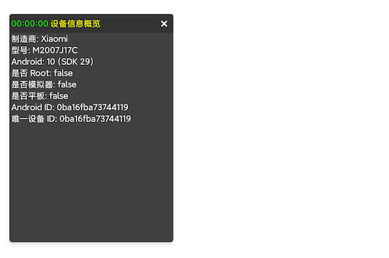

## 模块简介

`DeviceOps` 提供设备信息与状态查询能力，包括 Root/ADB 状态、系统版本、设备标识、厂商型号、模拟器/平板判断等。

> ⚠️ 部分接口不支持懒人精灵`最高权限`下运行(最高权限下获取不到Context)。


## 功能概览

- **上下文设置**：设置 Context（setContext，与 UtilsMain.init 二选一）
- **状态判断**：Root、ADB、开发者选项、模拟器、平板
- **设备控制**：关机、重启、重启到 Recovery/Bootloader（需 Root 权限）、友好返回桌面（双击退出）
- **系统版本**：SDK 名称与版本号
- **设备标识**：Android ID、MAC、唯一设备 ID（多重重载）、同设备校验、设备 ID（getDeviceId）
- **厂商型号**：manufacturer、model
- **硬件信息**：CPU 架构名称（ABI）
- **电池信息**：当前电量百分比、电池充电状态、电池健康度

## API 接口列表

#### setContext()

按需设置 Context（建议传入 applicationContext），在未调用 `UtilsMain.init` 时也可提前注入。

> setContext()和 UtilsMain.init() 二选一调用即可。

| 参数名 | 类型 | 必填 | 说明 |
|--------|------|------|------|
| context | Context | 是 | 应用或 Activity 的 context，建议 applicationContext |

| 返回值类型 | 说明 |
|-----------|------|
| void | 无 |

**示例：**
```lua
import('com.nx.assist.lua.LuaEngine')

local devOps = UtilsMain.deviceOps()

local context = LuaEngine.getContext()
devOps.setContext(context)  -- 传入已有的 context
```

### 1. 状态判断

#### isDeviceRooted()

判断设备是否已 Root。

| 参数名 | 类型 | 必填 | 说明 |
|--------|------|------|------|
| 无 | - | - | 无参数 |

| 返回值类型 | 说明 |
|-----------|------|
| Boolean | 已 Root 返回 true |

**示例：**
```lua
local devOps = UtilsMain.deviceOps()
print(devOps.isDeviceRooted())
```

#### isAdbEnabled()

判断是否开启 ADB。

| 参数名 | 类型 | 必填 | 说明 |
|--------|------|------|------|
| 无 | - | - | 无参数 |

| 返回值类型 | 说明 |
|-----------|------|
| Boolean | 开启返回 true |

**示例：**
```lua
local devOps = UtilsMain.deviceOps()
print(devOps.isAdbEnabled())
```

#### isDevelopmentSettingsEnabled()

判断开发者选项是否开启。

| 参数名 | 类型 | 必填 | 说明 |
|--------|------|------|------|
| 无 | - | - | 无参数 |

| 返回值类型 | 说明 |
|-----------|------|
| Boolean | 开启返回 true |

**示例：**
```lua
local devOps = UtilsMain.deviceOps()
print(devOps.isDevelopmentSettingsEnabled())
```

#### isTablet()

判断是否为平板设备。

| 参数名 | 类型 | 必填 | 说明 |
|--------|------|------|------|
| 无 | - | - | 无参数 |

| 返回值类型 | 说明 |
|-----------|------|
| Boolean | 平板返回 true |

**示例：**
```lua
local devOps = UtilsMain.deviceOps()
print(devOps.isTablet())
```

#### isEmulator()

判断是否为模拟器。

| 参数名 | 类型 | 必填 | 说明 |
|--------|------|------|------|
| 无 | - | - | 无参数 |

| 返回值类型 | 说明 |
|-----------|------|
| Boolean | 模拟器返回 true |

**示例：**
```lua
local devOps = UtilsMain.deviceOps()
print(devOps.isEmulator())
```

### 2. 设备控制

> ⚠️ **警告**：以下接口会直接控制设备，请谨慎使用！需要 Root 权限或系统权限。

#### shutdown()

关机设备。需要 Root 权限。

| 参数名 | 类型 | 必填 | 说明 |
|--------|------|------|------|
| 无 | - | - | 无参数 |

| 返回值类型 | 说明 |
|-----------|------|
| Boolean | 成功返回 true，失败返回 false |

**示例：**
```lua
local devOps = UtilsMain.deviceOps()
-- 注意：此操作会立即关机，请谨慎使用！
-- devOps.shutdown()
```

#### reboot()

重启设备。需要 Root 权限。

| 参数名 | 类型 | 必填 | 说明 |
|--------|------|------|------|
| 无 | - | - | 无参数 |

| 返回值类型 | 说明 |
|-----------|------|
| Boolean | 成功返回 true，失败返回 false |

**示例：**
```lua
local devOps = UtilsMain.deviceOps()
-- 注意：此操作会立即重启，请谨慎使用！
-- devOps.reboot()
```


#### rebootToRecovery()

重启到 Recovery 模式。需要 Root 权限。

| 参数名 | 类型 | 必填 | 说明 |
|--------|------|------|------|
| 无 | - | - | 无参数 |

| 返回值类型 | 说明 |
|-----------|------|
| Boolean | 成功返回 true，失败返回 false |

**示例：**
```lua
local devOps = UtilsMain.deviceOps()
-- 注意：此操作会立即重启到 Recovery，请谨慎使用！
-- devOps.rebootToRecovery()
```

#### rebootToBootloader()

重启到 Bootloader 模式。需要 Root 权限。

| 参数名 | 类型 | 必填 | 说明 |
|--------|------|------|------|
| 无 | - | - | 无参数 |

| 返回值类型 | 说明 |
|-----------|------|
| Boolean | 成功返回 true，失败返回 false |

**示例：**
```lua
local devOps = UtilsMain.deviceOps()
-- 注意：此操作会立即重启到 Bootloader，请谨慎使用！
-- devOps.rebootToBootloader()
```

#### back2HomeFriendly(tip: String)

在一定时间窗口内通过连续点击触发「友好返回桌面」逻辑，常用于实现「再按一次返回桌面/退出」的交互。

第一次调用会显示提示文案；若在提示时长内再次调用，则返回桌面并关闭提示。

| 参数名 | 类型 | 必填 | 说明 |
|--------|------|------|------|
| tip | String | 是 | 提示文案，如“再按一次返回桌面” |

| 返回值类型 | 说明 |
|-----------|------|
| Void | 无返回值，仅触发返回桌面的逻辑 |

**示例：**
```lua
local devOps = UtilsMain.deviceOps()

-- 在返回键回调中调用，第一次弹出提示，短时间内第二次调用则返回桌面
devOps.back2HomeFriendly('再按一次返回桌面')
```

#### back2HomeFriendly(tip: String, duration: Long)

在指定时间窗口内通过连续点击触发「友好返回桌面」逻辑，相比上一个重载可以自定义触发间隔时长。

| 参数名 | 类型 | 必填 | 说明 |
|--------|------|------|------|
| tip | String | 是 | 提示文案，如“再按一次返回桌面” |
| duration | Long | 是 | 触发间隔时间（毫秒），如 2000 表示 2 秒内第二次调用才会返回桌面 |

| 返回值类型 | 说明 |
|-----------|------|
| Void | 无返回值，仅触发返回桌面的逻辑 |

**示例：**
```lua
local devOps = UtilsMain.deviceOps()

-- 将双击时间窗口设置为 2 秒
devOps.back2HomeFriendly('再按一次返回桌面', 2000)
```

### 3. 系统版本

#### getSDKVersionName()

获取 SDK 名称（如 “Android 14”）。

| 参数名 | 类型 | 必填 | 说明 |
|--------|------|------|------|
| 无 | - | - | 无参数 |

| 返回值类型 | 说明 |
|-----------|------|
| String | SDK 名称 |

**示例：**
```lua
local devOps = UtilsMain.deviceOps()
print(devOps.getSDKVersionName())
```

#### getSDKVersionCode()

获取 SDK 版本号（整数）。

| 参数名 | 类型 | 必填 | 说明 |
|--------|------|------|------|
| 无 | - | - | 无参数 |

| 返回值类型 | 说明 |
|-----------|------|
| Int | SDK 版本号 |

**示例：**
```lua
local devOps = UtilsMain.deviceOps()
print(devOps.getSDKVersionCode())
```

### 4. 设备标识

#### getAndroidID()

获取 Android ID。

| 参数名 | 类型 | 必填 | 说明 |
|--------|------|------|------|
| 无 | - | - | 无参数 |

| 返回值类型 | 说明 |
|-----------|------|
| String | Android ID |

**示例：**
```lua
local devOps = UtilsMain.deviceOps()
print(devOps.getAndroidID())
```

#### getMacAddress()

获取 MAC 地址。

| 参数名 | 类型 | 必填 | 说明 |
|--------|------|------|------|
| 无 | - | - | 无参数 |

| 返回值类型 | 说明 |
|-----------|------|
| String | MAC 地址 |

**示例：**
```lua
local devOps = UtilsMain.deviceOps()
print(devOps.getMacAddress())
```

#### getUniqueDeviceId() 重载

获取唯一设备 ID，提供 3 个重载与 1 个带盐值重载。

| 签名 | 说明 |
|------|------|
| getUniqueDeviceId() | 默认生成 |
| getUniqueDeviceId(p0: String?) | 传入盐值字符串 |
| getUniqueDeviceId(p0: Boolean) | 是否使用硬件信息 |
| getUniqueDeviceId(p0: String?, p1: Boolean) | 同时指定盐值与是否使用硬件信息 |

| 返回值类型 | 说明 |
|-----------|------|
| String | 唯一设备 ID |

**示例：**
```lua
local devOps = UtilsMain.deviceOps()
print(devOps.getUniqueDeviceId())
print(devOps.getUniqueDeviceId("salt123"))
print(devOps.getUniqueDeviceId(true))
print(devOps.getUniqueDeviceId("salt123", true))
```

#### isSameDevice(p0: String?)

判断传入的设备 ID 是否与当前设备一致。

| 参数名 | 类型 | 必填 | 说明 |
|--------|------|------|------|
| p0 | String? | 是 | 设备 ID 字符串 |

| 返回值类型 | 说明 |
|-----------|------|
| Boolean | 相同返回 true |

**示例：**
```lua
local devOps = UtilsMain.deviceOps()
local id = devOps.getUniqueDeviceId()
print(devOps.isSameDevice(id))
```

### 5. 厂商与型号、设备信息

#### getManufacturer()

获取设备厂商。

| 参数名 | 类型 | 必填 | 说明 |
|--------|------|------|------|
| 无 | - | - | 无参数 |

| 返回值类型 | 说明 |
|-----------|------|
| String | 厂商名称 |

**示例：**
```lua
local devOps = UtilsMain.deviceOps()
print(devOps.getManufacturer())
```

#### getModel()

获取设备型号。

| 参数名 | 类型 | 必填 | 说明 |
|--------|------|------|------|
| 无 | - | - | 无参数 |

| 返回值类型 | 说明 |
|-----------|------|
| String | 型号名称 |

**示例：**
```lua
local devOps = UtilsMain.deviceOps()
print(devOps.getModel())
```

#### getCpuArchName()

获取 CPU 架构名称（ABI）。

通常返回系统首选 ABI，例如：`arm64-v8a`、`armeabi-v7a`、`x86_64`。

| 参数名 | 类型 | 必填 | 说明 |
|--------|------|------|------|
| 无 | - | - | 无参数 |

| 返回值类型 | 说明 |
|-----------|------|
| String | CPU 架构名称，获取失败时返回空字符串 |

**示例：**
```lua
local devOps = UtilsMain.deviceOps()
print(devOps.getCpuArchName()) -- 例如: arm64-v8a
```


#### getDeviceId()

获取设备 ID。

| 返回值类型 | 说明 |
|-----------|------|
| String | 设备 ID |

**示例：**
```lua
local devOps = UtilsMain.phoneOps()
print(devOps.getDeviceId())
```

### 6. 电池信息

#### getBattery()

获取当前电池电量百分比。

> 说明：正常情况下返回 0–100；如果获取失败，返回 -1。

| 参数名 | 类型 | 必填 | 说明 |
|--------|------|------|------|
| 无 | - | - | 无参数 |

| 返回值类型 | 说明 |
|-----------|------|
| Int | 电量百分比（0–100），失败时为 -1 |

**示例：**
```lua
local devOps = UtilsMain.deviceOps()
print('当前电量: ' .. tostring(devOps.getBattery()) .. '%')
```

#### isCharging()

判断当前设备是否处于充电状态。

| 参数名 | 类型 | 必填 | 说明 |
|--------|------|------|------|
| 无 | - | - | 无参数 |

| 返回值类型 | 说明 |
|-----------|------|
| Boolean | 充电中或已充满时返回 true |

**示例：**
```lua
local devOps = UtilsMain.deviceOps()
print('是否正在充电: ' .. tostring(devOps.isCharging()))
```

#### getBatteryHealth()

获取电池健康度（系统原始枚举值）。

> 返回值为系统 `BatteryManager.EXTRA_HEALTH` 对应的整型常量，例如：
> - `BATTERY_HEALTH_GOOD`：电池健康
> - `BATTERY_HEALTH_DEAD`：电池损坏
> - `BATTERY_HEALTH_OVERHEAT`：电池过热
> - `BATTERY_HEALTH_OVER_VOLTAGE`：电压异常
> - `BATTERY_HEALTH_UNSPECIFIED_FAILURE`：未知故障
> - `BATTERY_HEALTH_COLD`：电池过冷
> - 其他/异常情况一般为 `BATTERY_HEALTH_UNKNOWN`

| 参数名 | 类型 | 必填 | 说明 |
|--------|------|------|------|
| 无 | - | - | 无参数 |

| 返回值类型 | 说明 |
|-----------|------|
| Int | 系统电池健康度枚举值 |

**示例：**
```lua
local devOps = UtilsMain.deviceOps()
print('电池健康度: ' .. tostring(devOps.getBatteryHealth()))
```

## 组合示例

```lua
local devOps = UtilsMain.deviceOps()

-- 简单设备指纹
local info = {
  id = devOps.getUniqueDeviceId(),
  brand = devOps.getManufacturer(),
  model = devOps.getModel(),
  sdk = devOps.getSDKVersionName(),
  rooted = devOps.isDeviceRooted()
}
print(info)
```

## 完整示例

```lua
import('com.nx.assist.lua.LuaEngine')

-- 加载 APK 文件
local loader = LuaEngine.loadApk('xfxPlugin-release.apk')
if not loader then error('Failed to load APK') end

-- 获取上下文
local context = LuaEngine.getContext()

-- 加载插件主类
local UtilsMain = loader.loadClass('com.xfx.plugin.UtilsMain')
if not UtilsMain then error('Failed to load Class') end

-- 初始化插件
-- UtilsMain.init(context)

-- 获取设备工具
local devOps = UtilsMain.deviceOps()

print("=== 状态判断 ===")
print("Root?: " .. tostring(devOps.isDeviceRooted()))
print("平板?: " .. tostring(devOps.isTablet()))

print("\\n=== 系统版本 ===")
print("SDK 名称: " .. devOps.getSDKVersionName())
print("SDK 版本号: " .. tostring(devOps.getSDKVersionCode()))

print("\\n=== 设备标识 ===")
print("MAC: " .. devOps.getMacAddress())

print("\\n=== 厂商与型号 ===")
print("厂商: " .. devOps.getManufacturer())
print("型号: " .. devOps.getModel())

--------------------------------------------------------------------------------------
-- 以下方法依赖上下文环境，需要先设置上下文
devOps.setContext(context)

print("ADB?: " .. tostring(devOps.isAdbEnabled()))
print("开发者选项?: " .. tostring(devOps.isDevelopmentSettingsEnabled()))
print("模拟器?: " .. tostring(devOps.isEmulator()))

print("Android ID: " .. devOps.getAndroidID())
print("唯一设备ID: " .. devOps.getUniqueDeviceId())
print("唯一设备ID(含盐值): " .. devOps.getUniqueDeviceId("salt123"))
print("唯一设备ID(硬件信息): " .. devOps.getUniqueDeviceId(true))
print("唯一设备ID(盐值+硬件): " .. devOps.getUniqueDeviceId("salt123", true))

print("\\n=== 同设备校验示例 ===")
local id = devOps.getUniqueDeviceId()
print("isSameDevice(id): " .. tostring(devOps.isSameDevice(id)))

```


## OOP调用例子



```lua
-- ============================================
-- 设备信息获取示例
-- 演示如何使用 XfxPlugin.lua 调用 DeviceOps 获取设备信息
-- ============================================


-- 使用 XfxPlugin.lua 面向对象封装（推荐）
-- ============================================
print('========== 使用 XfxPlugin.lua 封装 ==========')

import('com.nx.assist.lua.LuaEngine')

-- 加载 XfxPlugin.lua 类
local xfxModule = require('lib/XfxPlugin')

-- 创建 XFX 对象实例
-- 注意：new 方法会自动初始化 UtilsMain.init(context)，所以可以直接使用 DeviceOps
local XFX = xfxModule:new({
    apkName = 'xfxPlugin-release.apk',  -- APK 文件名
    context = LuaEngine.getContext(),  -- 上下文对象（不支持最高权限）
})

-- 方法 1：通过 call 方法调用 DeviceOps 的方法
print('\n--- 通过 call 方法调用 ---')
local ok1, isRooted = pcall(function()
    return XFX:call('deviceOps', 'isDeviceRooted')
end)
local ok2, manufacturer = pcall(function()
    return XFX:call('deviceOps', 'getManufacturer')
end)

if ok1 and ok2 then
    print('设备是否 Root: ' .. tostring(isRooted))
    print('设备制造商: ' .. tostring(manufacturer))
else
    print('获取设备信息失败')
end

-- 方法 2：直接获取 devOps 对象，然后调用方法（更直观，推荐）
print('\n--- 直接获取 devOps 对象 ---')
local devOps = XFX:getOps('deviceOps')
if not devOps then
    error('无法获取 devOps 对象')
end

-- -- 部分方法依赖上下文环境，需要先设置上下文
-- devOps.setContext(LuaEngine.getContext())

-- A. 判断 Root / ADB
print('\n【权限和调试信息】')
local isRooted = devOps.isDeviceRooted()
local isAdbEnabled = devOps.isAdbEnabled()
local isDevSettingsEnabled = devOps.isDevelopmentSettingsEnabled()
print('是否 Root: ' .. tostring(isRooted))
print('ADB 是否开启: ' .. tostring(isAdbEnabled))
print('开发者选项是否开启: ' .. tostring(isDevSettingsEnabled))

-- B. Android 版本信息
print('\n【Android 版本信息】')
local sdkName = devOps.getSDKVersionName()
local sdkCode = devOps.getSDKVersionCode()
print('SDK 版本名称: ' .. tostring(sdkName))
print('SDK 版本代码: ' .. tostring(sdkCode))

-- C. 基本识别信息
print('\n【设备识别信息】')
local androidId = devOps.getAndroidID()
local macAddr = devOps.getMacAddress()
local manufacturer = devOps.getManufacturer()
local model = devOps.getModel()
print('Android ID: ' .. tostring(androidId))
print('MAC 地址: ' .. tostring(macAddr))
print('制造商: ' .. tostring(manufacturer))
print('型号: ' .. tostring(model))

-- D. 设备类型判断
print('\n【设备类型】')
local isTablet = devOps.isTablet()
local isEmulator = devOps.isEmulator()
print('是否平板: ' .. tostring(isTablet))
print('是否模拟器: ' .. tostring(isEmulator))

-- F. 唯一设备 ID（默认策略）
print('\n【唯一设备标识】')
local uniqueId = devOps.getUniqueDeviceId()
print('唯一设备 ID（默认）: ' .. tostring(uniqueId))

-- G. 唯一设备 ID（自定义前缀）
local uniqueIdWithPrefix = devOps.getUniqueDeviceId('my_app_')
print('唯一设备 ID（带前缀）: ' .. tostring(uniqueIdWithPrefix))

-- H. 唯一设备 ID（强制重新生成）
local uniqueIdForce = devOps.getUniqueDeviceId(true)
print('唯一设备 ID（强制重新生成）: ' .. tostring(uniqueIdForce))

-- I. 唯一设备 ID（前缀 + 强制重新生成）
local uniqueIdBoth = devOps.getUniqueDeviceId('my_app_', true)
print('唯一设备 ID（前缀+强制）: ' .. tostring(uniqueIdBoth))

-- J. 判断是否与指定 ID 为同一台设备
local sameDevice = devOps.isSameDevice(uniqueId)
print('与 uniqueId 是否同一设备: ' .. tostring(sameDevice))

-- 方法 3：结合悬浮日志窗口显示设备信息（更友好）
print('\n--- 使用悬浮日志窗口显示设备信息 ---')
local screenWidth, screenHeight = getDisplaySize()
XFX:showFloatLogWindow({
    title = '设备信息',
    width = math.floor(screenWidth / 2.5),
    height = math.floor(screenHeight / 4),
})
XFX:setFloatLogTitle('设备信息概览')
XFX:logi('制造商: ' .. manufacturer)
XFX:logi('型号: ' .. model)
XFX:logi('Android: ' .. sdkName .. ' (SDK ' .. sdkCode .. ')')
XFX:logi('是否 Root: ' .. tostring(isRooted))
XFX:logi('是否模拟器: ' .. tostring(isEmulator))
XFX:logi('是否平板: ' .. tostring(isTablet))
XFX:logi('Android ID: ' .. androidId)
XFX:logi('唯一设备 ID: ' .. uniqueId)

sleep(5000)  -- 显示 5 秒
XFX:closeFloatLog()  -- 关闭悬浮日志窗口

```

## 直接调用例子

```lua

import('com.nx.assist.lua.LuaEngine')

-- ============================================
-- 直接调用方式（不推荐，但可以了解底层实现）
-- ============================================
print('========== 直接调用方式 ==========')

local loader = LuaEngine.loadApk('xfxPlugin-release.apk')
if not loader then
    print('Failed to load APK')
    return
end

local context = LuaEngine.getContext()
local UtilsMain = loader.loadClass('com.xfx.plugin.UtilsMain')
if not UtilsMain then
    print('Failed to load Class')
    return
end

-- 初始化插件
-- UtilsMain.init(context)

-- 获取 DeviceOps
local devOps = UtilsMain.deviceOps()

-- 部分方法依赖上下文环境，需要先设置上下文
devOps.setContext(LuaEngine.getContext())

-- 获取设备信息
print('\n【设备基本信息】')
local manufacturer = devOps.getManufacturer()
local model = devOps.getModel()
local androidId = devOps.getAndroidID()
local sdkName = devOps.getSDKVersionName()
local sdkCode = devOps.getSDKVersionCode()

print('制造商: ' .. tostring(manufacturer))
print('型号: ' .. tostring(model))
print('Android ID: ' .. tostring(androidId))
print('Android 版本: ' .. tostring(sdkName) .. ' (SDK ' .. tostring(sdkCode) .. ')')

print('\n【设备状态】')
print('是否 Root: ' .. tostring(devOps.isDeviceRooted()))
print('ADB 是否开启: ' .. tostring(devOps.isAdbEnabled()))
print('是否模拟器: ' .. tostring(devOps.isEmulator()))
print('是否平板: ' .. tostring(devOps.isTablet()))

print('\n【唯一设备标识】')
local uniqueId = devOps.getUniqueDeviceId()
print('唯一设备 ID: ' .. tostring(uniqueId))
```

## 实际应用示例

```lua
import('com.nx.assist.lua.LuaEngine')

local xfxModule = require('lib/XfxPlugin')

local XFX = xfxModule:new({apkName = 'xfxPlugin-release.apk'})
XFX:setContext(LuaEngine.getContext())  -- 设置全局上下文环境

local devOps = XFX:getOps('deviceOps')

-- -- 部分方法依赖上下文环境，需要先设置上下文
-- devOps.setContext(LuaEngine.getContext())

-- ============================================
-- 示例 1：设备指纹识别
-- ============================================
print('========== 示例 1：设备指纹识别 ==========')

-- 生成设备指纹（用于设备识别、防作弊等）
local function generateDeviceFingerprint()
    local manufacturer = devOps.getManufacturer()
    local model = devOps.getModel()
    local androidId = devOps.getAndroidID()
    local uniqueId = devOps.getUniqueDeviceId('app_')
    
    -- 组合生成设备指纹
    local fingerprint = manufacturer .. '_' .. model .. '_' .. androidId .. '_' .. uniqueId
    return fingerprint
end

local fingerprint = generateDeviceFingerprint()
print('设备指纹: ' .. fingerprint)

-- ============================================
-- 示例 2：环境检测（防作弊）
-- ============================================
print('\n========== 示例 2：环境检测 ==========')

local function checkEnvironment()
    local isRooted = devOps.isDeviceRooted()
    local isEmulator = devOps.isEmulator()
    local isAdbEnabled = devOps.isAdbEnabled()
    
    local warnings = {}
    
    if isRooted then
        table.insert(warnings, '设备已 Root')
    end
    
    if isEmulator then
        table.insert(warnings, '运行在模拟器上')
    end
    
    if isAdbEnabled then
        table.insert(warnings, 'ADB 调试已开启')
    end
    
    if #warnings > 0 then
        print('⚠️ 环境警告:')
        for i, warning in ipairs(warnings) do
            print('  ' .. i .. '. ' .. warning)
        end
        return false
    else
        print('✓ 环境检测通过')
        return true
    end
end

local envOk = checkEnvironment()

-- ============================================
-- 示例 3：设备兼容性检查
-- ============================================
print('\n========== 示例 3：设备兼容性检查 ==========')

local function checkCompatibility()
    local sdkCode = devOps.getSDKVersionCode()
    local isTablet = devOps.isTablet()
    
    -- 检查 Android 版本（例如：要求 Android 5.0 以上，SDK 21+）
    local minSdk = 21
    if sdkCode < minSdk then
        print('❌ Android 版本过低，需要 Android 5.0 (SDK ' .. minSdk .. ') 以上')
        return false
    end
    
    -- 检查设备类型
    if isTablet then
        print('ℹ️  检测到平板设备，可能需要特殊适配')
    end
    
    print('✓ 设备兼容性检查通过')
    return true
end

local compatible = checkCompatibility()

-- ============================================
-- 示例 4：设备唯一标识管理
-- ============================================
print('\n========== 示例 4：设备唯一标识管理 ==========')

-- 获取或生成设备唯一标识（用于用户识别、数据统计等）
local function getOrCreateDeviceId()
    -- 尝试获取已保存的设备 ID
    local fileOps = XFX:getOps('fileOps')
    local deviceIdFile = '/sdcard/.device_id.txt'
    
    if fileOps.isExists(deviceIdFile) then
        -- 读取已保存的设备 ID
        local savedId = fileOps.read(deviceIdFile)
        if savedId and string.len(savedId) > 0 then
            print('读取已保存的设备 ID: ' .. savedId)
            return savedId
        end
    end
    
    -- 生成新的设备 ID
    local newId = devOps.getUniqueDeviceId('app_user_')
    print('生成新的设备 ID: ' .. newId)
    
    -- 保存设备 ID
    fileOps.create(deviceIdFile)
    fileOps.write(deviceIdFile, newId)
    print('设备 ID 已保存到: ' .. deviceIdFile)
    
    return newId
end

local deviceId = getOrCreateDeviceId()
print('当前设备 ID: ' .. deviceId)

-- ============================================
-- 示例 5：设备信息汇总报告
-- ============================================
print('\n========== 示例 5：设备信息汇总报告 ==========')

local function generateDeviceReport()
    local report = {}
    
    report.manufacturer = devOps.getManufacturer()
    report.model = devOps.getModel()
    report.androidVersion = devOps.getSDKVersionName()
    report.sdkCode = devOps.getSDKVersionCode()
    report.androidId = devOps.getAndroidID()
    report.uniqueId = devOps.getUniqueDeviceId()
    report.isRooted = devOps.isDeviceRooted()
    report.isEmulator = devOps.isEmulator()
    report.isTablet = devOps.isTablet()
    report.isAdbEnabled = devOps.isAdbEnabled()
    
    -- 获取屏幕信息（需要 screenOps）
    local scOps = XFX:getOps('screenOps')
    -- scOps.setContext(LuaEngine.getContext()) -- 设置上下文（如果需要）
    if scOps then
        report.screenWidth = scOps.getScreenWidth()
        report.screenHeight = scOps.getScreenHeight()
        report.screenDpi = scOps.getScreenDensityDpi()
    end
    
    return report
end

local report = generateDeviceReport()
print('\n【设备信息报告】')
print('制造商: ' .. report.manufacturer)
print('型号: ' .. report.model)
print('Android 版本: ' .. report.androidVersion .. ' (SDK ' .. report.sdkCode .. ')')
print('屏幕尺寸: ' .. (report.screenWidth or 'N/A') .. ' x ' .. (report.screenHeight or 'N/A'))
print('屏幕 DPI: ' .. (report.screenDpi or 'N/A'))
print('是否 Root: ' .. tostring(report.isRooted))
print('是否模拟器: ' .. tostring(report.isEmulator))
print('是否平板: ' .. tostring(report.isTablet))

print('\n示例执行完成！')
```


## 注意事项

- **初始化要求**：使用前需先调用 `xxxOps.setContext(context)`或`UtilsMain.init(context)` 初始化上下文。
- **权限/可用性**：部分标识（如 MAC）在新系统或未授权时可能返回空串；模拟器检测结果因环境不同而异。
- **设备控制接口**：`shutdown()`、`reboot()`、`rebootToRecovery()`、`rebootToBootloader()` 等接口会直接控制设备，需要 Root 权限或系统权限，请谨慎使用！这些操作会立即生效，可能导致数据丢失。


