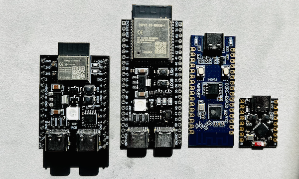

## 模块简介

`HidOps` 提供基于 ESP32 蓝牙设备的操作能力(ESP32 C3/S3)，包括自动连接、按坐标点击/滑动、剪贴板快捷键、导航按键、以及设备信息查询等。

## 功能概览

- **初始化与上下文**：设置 Context（setContext）
- **权限与蓝牙状态**：检查蓝牙连接权限（requestBlePermission）、检查蓝牙是否开启（isBluetoothEnabled）
- **连接相关**：自动连接（autoConnect）、按 MAC 连接（macConnect）、获取首个设备 MAC/名称（getFirstMac/getFirstName）
- **基本 HID 操作**：点击（click）、快速点击（qClick）、双击（dbClick）、按下/释放（press/release）
- **滑动操作**：简单滑动（swipe）、可控滑动（swipeEx）
- **剪贴板与按键**：复制/剪切/全选/粘贴（copy/cut/selectAll/paste）、主页/退格/菜单/返回/最近任务/回车（home/backspace/menu/back/recent/enter）
- **自动点击与设备控制**：设置自动点击点（setAutoClickPoint）、重启设备（restart）、查询状态（getState）
- **设备信息查询**：完整信息（getInfo）、ID/MAC/名称/版本/型号/烧录时间/运行时间（getID/getMac/getName/getVersion/getModel/getBurnTime/getRunTime）
- **辅助接口**：获取 WiFi 内网 IP（getWifiIP）

## 支持的单片机



## 视频演示

::: video bilibili
BV1W1UaBQEwy
:::

## 插件错误码一览

| code | 常量名                         | 说明                     |
|------|-------------------------------|--------------------------|
| 200    | `ERR_OK`                      | 成功                     |
| -1   | `ERR_INVALID_PARAM`           | 参数无效                 |
| -2   | `ERR_NO_CONTEXT`              | 未设置 Context           |
| -3   | `ERR_BLUETOOTH_NOT_ENABLED`   | 蓝牙未开启/设备不支持   |
| -4   | `ERR_NOT_CONNECTED`           | 未连接 HID 设备         |
| -5   | `ERR_CONNECTION_FAILED`       | 连接失败或超时          |
| -6   | `ERR_OPERATION_FAILED`        | 其它操作失败             |

`msg` 字段为错误说明，`data` 为字符串数据（成功时通常为 HID 设备返回的 JSON 文本或简单值，失败时为 `null`）。


## 初始化与上下文

### setContext(context)

按需设置全局 `Context`（推荐 ApplicationContext）。未调用 `UtilsMain.init(context)` 也可直接使用。

> 二选一：调用 `HidOps.setContext(context)` 或 `UtilsMain.init(context)` 任一方式即可。

| 参数名  | 类型    | 必填 | 说明                       |
|--------|---------|------|----------------------------|
| context | Context | 是  | 通常传 `LuaEngine.getContext()` |

| 返回值类型 | 说明                   |
|-----------|------------------------|
| void      | 无返回值              |

**示例（直接获取 HidOps）：**

```lua
import('com.nx.assist.lua.LuaEngine')

local loader = LuaEngine.loadApk('xfxPlugin-release.apk')
local UtilsMain = loader.loadClass('com.xfx.plugin.UtilsMain')

local context = LuaEngine.getContext()
local hidOps = UtilsMain.hidOps()

hidOps.setContext(context)  -- 建议先设置一次
```

**示例（通过 XfxPlugin.lua OOP 封装）：**

```lua
import('com.nx.assist.lua.LuaEngine')

local XfxPlugin = require('lib/XfxPlugin')
local XFX = XfxPlugin:new({
    apkName = 'xfxPlugin-release.apk',
    context = LuaEngine.getContext(),
})

local hidOps = XFX:getOps('hidOps')  -- 内部已处理 Context
```

## 1. 权限与蓝牙状态

### requestBlePermission()

检查是否具备 `BLUETOOTH_CONNECT` 权限（Android 12+）。**不会主动弹系统授权框**，仅返回状态，实际授权需在宿主 App 中处理。

| 参数名 | 类型 | 必填 | 说明   |
|--------|------|------|--------|
| 无     |  -   |  -   | 无参数 |

返回 JSON：

- `code = 200`：已具备或不需要该权限；
- `code = -6`：缺少权限（`msg` 中给出说明）。

**Lua 调用示例：**

```lua
local result = hidOps.requestBlePermission()
print(result)
```

### isBluetoothEnabled()

检查当前设备是否支持并已开启蓝牙。

| 参数名 | 类型 | 必填 | 说明   |
|--------|------|------|--------|
| 无     |  -   |  -   | 无参数 |

返回 JSON：

- 支持且已开启：`code = 200`；
- 不支持 / 未开启：`code = -3`，`msg` 为原因。

## 2. 连接相关

### autoConnect()

自动连接首个以 `XFX` 开头的 BLE 设备。优先查找已连接的设备，如果没有找到已连接的设备则返回错误。

| 参数名 | 类型 | 必填 | 说明 |
|--------|------|------|------|
| 无     |  -   |  -   | 无参数 |

返回 JSON：

- 成功：`code = 200`；
- 失败：`code = -3 / -5 / -6` 等。

**Lua 示例：**

```lua
local r = hidOps.autoConnect()
print('autoConnect => ' .. r)    -- {"code":200,"msg":"ok","data":""}
```

### macConnect(mac)

按 MAC 地址连接指定设备。

| 参数名 | 类型   | 必填 | 说明                          |
|--------|--------|------|-------------------------------|
| mac    | String | 是   | 目标设备 MAC，如 `AA:BB:CC:DD:EE:FF` |

返回 JSON：同 `autoConnect()`。

**Lua 示例：**

```lua
local r = hidOps.macConnect("AA:BB:CC:DD:EE:FF")
print('macConnect => ' .. r)
```

### getFirstMac() / getFirstName()

从已配对设备中查找首个已连接、符合设备 UUID 且名称以 `XFX` 开头的设备，返回其 MAC 或名称。

| 方法名        | 说明             |
|--------------|------------------|
| getFirstMac() | 返回内网 MAC    |
| getFirstName() | 返回蓝牙名称   |

返回 JSON：

- 成功：`code = 200`, `data = "<mac 或 name>"`；
- 失败：`code = -6`。

## 3. 基本 HID 操作

### click(x, y)

在屏幕坐标 `(x, y)` 位置模拟一次点击（按下+抬起）。

| 参数名 | 类型   | 必填 | 说明             |
|--------|--------|------|------------------|
| x      | Double | 是   | 屏幕 X 坐标 >= 0 |
| y      | Double | 是   | 屏幕 Y 坐标 >= 0 |

返回 JSON：`data` 通常为 HID 设备返回的 JSON 文本。

**Lua 示例：**

```lua
local r = hidOps.click(540.0, 960.0)
print('click => ' .. r)
```

### qClick(x, y, interval)

快速点击（按下一段时间后抬起）。

| 参数名   | 类型   | 必填 | 说明                       |
|----------|--------|------|----------------------------|
| x        | Double | 是   | 屏幕 X 坐标 >= 0           |
| y        | Double | 是   | 屏幕 Y 坐标 >= 0           |
| interval | Double | 是   | 按下与抬起间隔（毫秒）> 0 |

### dbClick(x, y, interval, gap)

双击操作。

| 参数名   | 类型   | 必填 | 说明                         |
|----------|--------|------|------------------------------|
| x        | Double | 是   | 屏幕 X 坐标 >= 0             |
| y        | Double | 是   | 屏幕 Y 坐标 >= 0             |
| interval | Double | 是   | 每次按下持续时间（毫秒）> 0 |
| gap      | Double | 是   | 两次点击之间间隔（毫秒）> 0 |

### press(x, y) / release()

分离的按下与释放：

| 方法       | 参数                           | 说明           |
|------------|--------------------------------|----------------|
| press(x,y) | `x: Double`, `y: Double`      | 只按下不抬起   |
| release()  | 无                             | 只释放（归零） |

> 典型用法：`press(x, y)` → 拖动若干点 → `release()`。

## 4. 滑动操作

### swipe(x, y, ex, ey)

从起点 `(x, y)` 滑动到终点 `(ex, ey)`，内部自动插值步数。

| 参数名 | 类型   | 必填 | 说明             |
|--------|--------|------|------------------|
| x      | Double | 是   | 起点 X           |
| y      | Double | 是   | 起点 Y           |
| ex     | Double | 是   | 终点 X           |
| ey     | Double | 是   | 终点 Y           |

### swipeEx(startX, startY, endX, endY, steps, stepDelay)

可控滑动：自定义步数与每步延迟。

| 参数名    | 类型   | 必填 | 说明                           |
|-----------|--------|------|--------------------------------|
| startX    | Double | 是   | 起点 X                         |
| startY    | Double | 是   | 起点 Y                         |
| endX      | Double | 是   | 终点 X                         |
| endY      | Double | 是   | 终点 Y                         |
| steps     | Double | 是   | 步数，> 0（将取整为 Int）      |
| stepDelay | Long   | 是   | 每步延迟毫秒，>= 0            |

**Lua 示例：**

```lua
-- 从下往上滑 500 像素，分 20 步，每步 5ms
local r = hidOps.swipeEx(540.0, 1600.0, 540.0, 1100.0, 20.0, 5)
print('swipeEx => ' .. r)
```

## 5. 剪贴板与按键

以下方法均无入参，所有参数必须显式写空圆括号：

| 方法名      | 说明           |
|-------------|----------------|
| copy()      | 复制           |
| cut()       | 剪切           |
| selectAll() | 全选           |
| paste()     | 粘贴           |
| home()      | 主页键         |
| backspace() | 退格键         |
| menu()      | 菜单键         |
| back()      | 返回键         |
| recent()    | 最近任务键     |
| enter()     | 回车键         |

**Lua 示例：**

```lua
hidOps.copy()
hidOps.paste()
hidOps.home()
hidOps.back()
-- {"code":200,"msg":"success","data":""}
```

## 6. 自动点击与设备信息

### setAutoClickPoint(x, y, timeout)

配置自动点击点及超时时间。

| 参数名  | 类型   | 必填 | 说明                           |
|---------|--------|------|--------------------------------|
| x       | Double | 是   | 屏幕 X 坐标 >= 0              |
| y       | Double | 是   | 屏幕 Y 坐标 >= 0              |
| timeout | Double | 是   | 超时时间毫秒，0 表示停止自动点击 |

### restart()

重启 HID 设备。

### getState()

查询当前 HID 设备运行状态。

| 参数名 | 类型 | 必填 | 说明   |
|--------|------|------|--------|
| 无     |  -   |  -   | 无参数 |

返回 JSON：`data` 字段为设备状态信息（设备固件返回的 JSON 文本）。

### getInfo()

查询设备完整信息（包含版本、型号、MAC、ID、名称、运行时间等）。

| 参数名 | 类型 | 必填 | 说明   |
|--------|------|------|--------|
| 无     |  -   |  -   | 无参数 |

返回 JSON：`data` 字段为设备信息的 JSON 对象（设备固件返回的 JSON 文本）。

```json
{"code":200,"msg":"success","data":{"version":"11","model":"ESP32-C3","mac":"E4:B0:63:CC:9C:8C","id":"E4B063CC9C8C","name":"XFX-CC9C8C-v11","burnTime":"","runTime":"5167204"}}
```

### 设备属性查询方法

以下方法用于查询设备的单个属性，均无参数：

| 方法名        | 说明                 | 返回 `data` 示例      |
|---------------|----------------------|----------------------|
| getID()       | 设备唯一标识         | `"AABBCCDDEEFF"`     |
| getMac()      | HID 设备 MAC 地址    | `"AA:BB:CC:DD:EE:FF"`|
| getName()     | HID 设备名称         | `"XFX-1234-v11"`     |
| getVersion()  | 固件版本号           | `"11"`               |
| getModel()    | 硬件芯片型号         | `"ESP32-C3"`         |
| getBurnTime() | 烧录时间/次数        | `""`（暂未实现）     |
| getRunTime()  | 累计运行时间（毫秒） | `"123456"`           |

所有上述方法返回 JSON：`{"code": Int, "msg": String, "data": String}`，其中 `data` 为字符串值。

## 7. 辅助接口：网络

| 方法名             | 返回 `data` 示例      | 说明                    |
|--------------------|------------------------|-------------------------|
| getWifiIP()        | `"192.168.1.100"`      | 当前 WiFi 内网 IP      |

## 8. 综合 Lua 示例

```lua
import('com.nx.assist.lua.LuaEngine')

local XfxPlugin = require('lib/XfxPlugin')

-- 创建 XFX 对象并初始化
local XFX = XfxPlugin:new({
    apkName = 'xfxPlugin-release.apk',
    context = LuaEngine.getContext(),
})

local hidOps = XFX:getOps('hidOps')

-- 检查权限与蓝牙
print(hidOps.requestBlePermission())
print(hidOps.isBluetoothEnabled())

-- 自动连接
local connectResult = hidOps.autoConnect()
print('autoConnect => ' .. connectResult)

print(hidOps.home())
sleep(1000)

-- 简单点击
local clickResult = hidOps.click(540,1532)
print('click => ' .. clickResult)
sleep(1000)

-- 长滑动
local swipeResult = hidOps.swipe(553,1865, 571,547)
print('swipe => ' .. swipeResult)
sleep(1000)

-- 查询设备信息
print(hidOps.getInfo())
print(hidOps.getVersion())
print(hidOps.getModel())
```

## 9. 完整接口调用示例

以下示例展示了 `HidOps` 所有接口的调用方式：

```lua
import('com.nx.assist.lua.LuaEngine')
local XfxPlugin = require('lib/XfxPlugin')

-- 初始化
local XFX = XfxPlugin:new({
    apkName = 'xfxPlugin-release.apk',
    context = LuaEngine.getContext(),
})
local hidOps = XFX:getOps('hidOps')

-- ========== 1. 权限与蓝牙状态 ==========
print("=== 权限与蓝牙状态 ===")
print("权限检查:", hidOps.requestBlePermission())
print("蓝牙状态:", hidOps.isBluetoothEnabled())

-- ========== 2. 连接相关 ==========
print("\n=== 连接相关 ===")
-- 自动连接
print("自动连接:", hidOps.autoConnect())
-- 按 MAC 连接（示例）
-- print("MAC连接:", hidOps.macConnect("AA:BB:CC:DD:EE:FF"))
-- 获取首个设备信息
print("首个MAC:", hidOps.getFirstMac())
print("首个名称:", hidOps.getFirstName())

hidOps.recent()
sleep(1000)

hidOps.home()
sleep(1000)

-- ========== 3. 基础 HID 操作 ==========
print("\n=== 基础 HID 操作 ===")
-- 点击
print("点击:", hidOps.click(540,1527))
sleep(1000)

-- -- 快速点击
-- print("快速点击:", hidOps.qClick(540.0, 960.0, 100.0))
-- -- 双击
-- print("双击:", hidOps.dbClick(540.0, 960.0, 50.0, 100.0))
-- 按下
print("按下:", hidOps.press(540,1527))
sleep(3*1000)
-- 释放
print("释放:", hidOps.release())
sleep(1000)

-- ========== 4. 滑动操作 ==========
print("\n=== 滑动操作 ===")
-- 简单滑动
print("滑动:", hidOps.swipe(540.0, 1600.0, 540.0, 400.0))
-- 高级滑动（自定义步数和延迟）
print("高级滑动:", hidOps.swipeEx(540.0, 1600.0, 540.0, 400.0, 20.0, 5))

-- ========== 5. 剪贴板与按键 ==========
print("\n=== 剪贴板与按键 ===")
print("复制:", hidOps.copy())
print("剪切:", hidOps.cut())
print("全选:", hidOps.selectAll())
print("粘贴:", hidOps.paste())
print("主页:", hidOps.home())
print("退格:", hidOps.backspace())
print("菜单:", hidOps.menu())
print("返回:", hidOps.back())
print("最近任务:", hidOps.recent())
print("回车:", hidOps.enter())

-- ========== 6. 自动点击与设备控制 ==========
print("\n=== 自动点击与设备控制 ===")
-- -- 设置自动点击点
-- print("设置自动点击点:", hidOps.setAutoClickPoint(540.0, 1600.0, 3000.0))
-- 查询状态
print("设备状态:", hidOps.getState())
-- 重启设备（谨慎使用）
-- print("重启设备:", hidOps.restart())

-- ========== 7. 设备信息查询 ==========
print("\n=== 设备信息查询 ===")
print("设备信息:", hidOps.getInfo())
print("设备ID:", hidOps.getID())
print("设备MAC:", hidOps.getMac())
print("设备名称:", hidOps.getName())
print("固件版本:", hidOps.getVersion())
print("硬件型号:", hidOps.getModel())
print("烧录时间:", hidOps.getBurnTime())
print("运行时间:", hidOps.getRunTime())

-- ========== 8. 辅助接口 ==========
print("\n=== 辅助接口 ===")
print("WiFi IP:", hidOps.getWifiIP())

print("\n=== 所有接口调用完成 ===")
```

**注意事项：**
- 所有接口调用前需确保已成功连接设备（调用 `autoConnect()` 或 `macConnect()`）
- 坐标参数必须为非负数
- 时间参数（interval、gap、timeout、stepDelay）必须 >= 0
- 无参数方法必须显式写空括号 `()`
- 返回值均为 JSON 字符串，格式：`{"code": Int, "msg": String, "data": String?}`

## 注意事项

- **初始化顺序**：在任意 `HidOps` 调用前，务必先调用 `HidOps.setContext(context)` 或 `UtilsMain.init(context)`；
- **权限**：在 Android 12+ 上必须由宿主 App 预先申请 `BLUETOOTH_CONNECT` 和位置等权限，否则连接接口会返回错误；
- **返回值一律为 JSON 字符串**：`{"code": Int, "msg": String, "data": String?}`，“200/success 是单片机返回”，“200/ok 是插件工具返回”。


